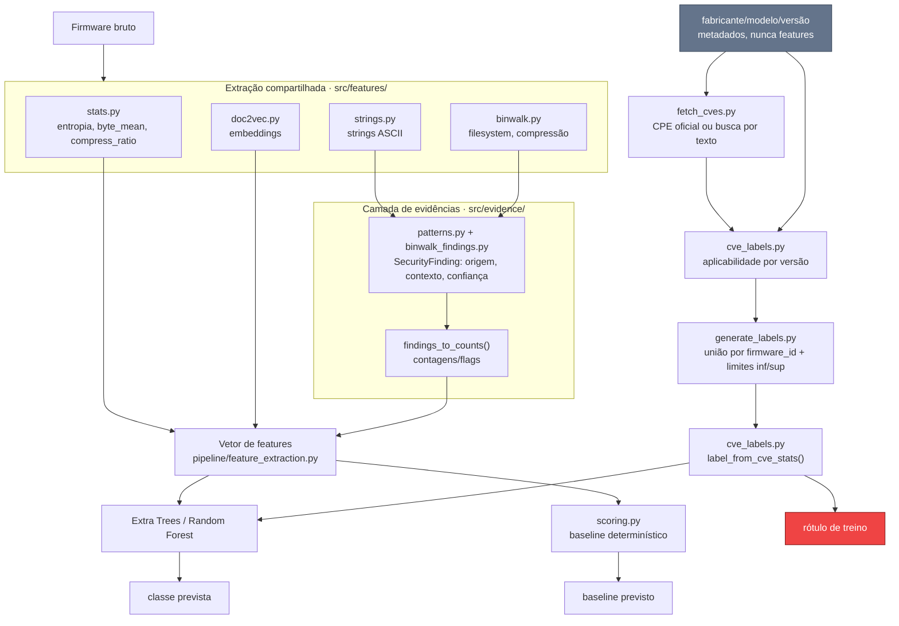

# Pipeline de classificação por CVE

Este documento consolida a arquitetura resultante do refactor em
`refactor/project-structure-review`: como o firmware é extraído,
interpretado como evidência, rotulado por CVE e classificado, mantendo
features e rótulo de treino em contratos independentes.

## Princípio central

> A extração identifica fatos observáveis; a camada de evidências
> interpreta esses fatos; a rotulagem usa uma fonte externa (CVE),
> independente das features; o classificador infere a classe; o
> baseline determinístico serve só de comparação, nunca de verdade.

```
firmware bruto -> extração -> evidência -> features + rótulo CVE -> classificador / baseline
```

## Visão geral



## Os quatro estágios

Cada estágio tem um contrato de entrada/saída próprio e pode ser testado
isoladamente.

### 1. Extração (núcleo compartilhado)

Lê o binário e produz fatos observáveis, sem julgamento de segurança nem
alvo de classificação embutido.

- `src/feature_extraction.py`
- `src/features/statistics.py` (entropia, byte_mean, compress_ratio)
- `src/features/strings.py`, `src/features/doc2vec.py`
- `src/features/binwalk.py` (sinais estruturais: filesystem, compressão)

### 2. Camada de evidências

Interpreta as strings e a saída do Binwalk já extraídas. Nunca lê o
firmware de novo.

- `src/evidence/findings.py` define `SecurityFinding` (type, source,
  context, confidence, detector, detector_version)
- `src/evidence/patterns.py`: 8 detectores (credenciais, IPs, serviços
  expostos, libs desatualizadas, URLs, tokens)
- `src/evidence/binwalk_findings.py`: assinaturas de cripto e seções
  criptografadas
- `scripts/extract_features.py --findings-output` grava os achados em
  JSONL, correlacionáveis ao `features.parquet` por `firmware_id`

### 3. Rotulagem por CVE

O rótulo de treino depende apenas de CVEs avaliadas para os metadados da
imagem. O treino faz merge com `labels_v2.csv` por `firmware_id` e usa
dele somente `security_level`. `vendor`, `model`, `version`,
`version_source`, `cve_total` e `cvss_max` ficam fora do vetor, assim como
todas as colunas `meta_*` do parquet. Essa separação evita vazamento:
`version_source` nulo tende a coincidir com `indeterminado` e antecipa o
rótulo.

- `pipeline/feature_extraction.py` preserva a versão inferida do path em
  `meta_version`, junto ao fabricante e modelo. `meta_version_source`
  registra `directory` quando a versão vem do sufixo do diretório do
  modelo, `filename` quando vem do fallback pelo nome do arquivo, ou nulo
  quando não há versão. O diretório tem prioridade. Os dois campos ficam
  fora do vetor de features.
- `scripts/fetch_cves.py` procura um CPE oficial correspondente ao par
  fabricante/modelo; se não o encontra, consulta a NVD por texto. O cache
  guarda cada CVE com ID, CVSS, critério CPE, limites de versão e a
  configuração lógica original. Uma CVE sem dados CPE é considerada
  aplicável por padrão conservador.
- `src/labeling/version_match.py` compara segmentos numéricos e respeita
  limites inclusivos e exclusivos.
- `src/labeling/cve_labels.py` avalia todas as CVEs e devolve duas listas:
  aplicáveis e indeterminadas. Sem versão parseável, todas as CVEs da
  entrada ficam indeterminadas; uma entrada vazia continua sendo
  evidência de `sem_cve_conhecida`.
- A versão CPE exata e os limites `versionStart*`/`versionEnd*` são
  normalizados pela mesma convenção da extração: remove-se `v`/`V`
  inicial; ASUS troca `_` por `.`; Netgear remove o pacote após `_`, mas
  deixa o resultado indeterminado quando o firmware coincide com a base.
  Sufixos de build (`Bxx`, beta ou variante regional como `_ww`) não são
  cortados. Na versão CPE exata, o match por `casefold` continua aplicável.
  Se a CPE normalizada tem sufixo e sua base numérica, com padding de
  zeros, coincide com a versão do firmware, a guarda B devolve `None`
  quando o firmware não tem sufixo (build desconhecido). Para firmware
  com sufixo próprio, devolve `None` apenas quando a CPE é a versão
  completa do firmware seguida de separador e qualificador extra; build
  conhecido diferente devolve `False`. Base numérica distinta também
  devolve `False`.
- `scripts/generate_labels.py` grava `version_source` logo após `version`
  no `labels_v2.csv`. Como o `features_v2.parquet` atual foi extraído
  antes de `meta_version_source`, o script reinfere a origem a partir de
  `meta_path`. A escolha é consciente: versão e origem seguem a mesma
  regra, e a checagem contra `meta_version` falha se o parquet estiver
  desatualizado. Portanto, qualquer mudança nas regras de extração de
  versão exige reextrair as features antes de regerar os rótulos.
  `meta_version_source` no parquet serve para auditar a tabela de
  features.
- O mesmo script une por ID as aplicáveis (`A`) e as indeterminadas (`U`)
  de todos os aliases do mesmo `firmware_id`. Calcula `inf = label(A)` e
  `sup = label(A ∪ U)`: usa `inf` quando os dois limites coincidem e
  `indeterminado` quando divergem. `cve_total` e `cvss_max` sempre
  descrevem apenas `A`, portanto são limites inferiores. Par
  fabricante/modelo ausente no cache gera erro. O arquivo `labels.csv`
  mantém o estado `indeterminado`, que deve ser excluído pelo futuro
  código de treino.

### 4. Classificação e baseline

O classificador nunca vê CVE; o baseline nunca é tratado como verdade.

- Extra Trees (modelo principal), Random Forest (baseline de ML)
- `src/scoring.py`: baseline determinístico baseado em regras (stats +
  strings + binwalk, sem sinal CVE)
- Teste de guarda em `tests/test_pipeline_extraction.py` bloqueia
  `cvss_max`, `cve_count_*`, `cve_total`, `brand`, `model`, `version` do vetor de
  features

## Mecanismo: firmware reaproveitado sob vários modelos

Fabricantes reaproveitam o mesmo binário sob nomes comerciais diferentes
(hardware "rebadged"). A cobertura de pesquisa de CVE varia por nome de
modelo mesmo quando o código é idêntico.

Exemplo real do dataset: o ASUS RT-AC68U
`3.0.0.4.384.45717`, com `firmware_id` `037823e4...`, aparece sob vários
aliases. Pela regra anterior, saía como `cve_conhecida`. A união estrita
inclui a CVE-2021-45756, aplicável e com CVSS 9.8; por isso, o rótulo
correto agora é `cve_critica`.

Todos os aliases desse binário recebem o mesmo rótulo agregado. Uma CVE
indeterminada só deixa de ampliar o limite superior se o mesmo ID já
estiver comprovado como aplicável em outro alias.

## Antes / depois do refactor

| | Antes | Depois |
|---|---|---|
| Alvo | fabricante/tipo de dispositivo | classe de vulnerabilidade conhecida |
| Rótulo | `score_firmware()` combinando stats + strings + binwalk + CVE | `label_from_cve_stats()` sobre CVEs aplicáveis à versão |
| Classes | `seguro` / `vulneravel` / `critico` | `sem_cve_conhecida` / `cve_conhecida` / `cve_critica`; `indeterminado` é estado de qualidade |
| Risco de vazamento | classificador podia reaprender a própria fórmula do scoring | teste de guarda impede CVE e metadados de identidade no vetor de features |
| Par ausente no cache CVE | virava `seguro` silenciosamente | interrompe a execução com erro |

## Escala de severidade

`label_from_cve_stats()` decide o ground truth apenas com `cve_total` e
`cvss_max`. A agregação une por ID as CVEs aplicáveis e indeterminadas de
todos os aliases. O rótulo só é conclusivo quando
`label(aplicáveis) == label(aplicáveis ∪ indeterminadas)`.
`cve_total` e `cvss_max` contam apenas as aplicáveis e, portanto, são um
limite inferior.

`LEVEL_ORDER` em `src/scoring.py` e as hard rules (`has_telnetd`,
`has_debug_account`, senha hardcoded) pertencem somente ao baseline
determinístico. Eles nunca alteram o rótulo de treino.

| Classe | Definição |
|---|---|
| `sem_cve_conhecida` | Os limites inferior e superior não contêm CVE. Isso inclui uma entrada vazia no cache mesmo sem versão. Não prova ausência de vulnerabilidade. |
| `cve_conhecida` | Ao menos uma CVE abaixo do limiar crítico (CVSS < 9.0 por padrão). |
| `cve_critica` | CVE com CVSS >= 9.0 (`CveLabelThresholds.critical_cvss`, ajustável via `--critical-cvss`). |
| `indeterminado` | Incerteza de versão ou condição CPE faz os limites inferior e superior produzirem classes diferentes. Estado de qualidade, fora das classes de treino. |

## Estado real do dataset (`labels_v2.csv` de 2026-09-23)

O `labels_v2.csv` foi gerado de `dataset/processed/features_v2.parquet` e
`dataset/cve_cache_v2.json`: 840 linhas e 699 `firmware_id`. A comparação
antes/depois da regra C + B1, da guarda B e da opção (b) do campo
`update` é:

| Rótulo | Antes (linhas) | Depois (linhas) | Antes (`firmware_id`) | Depois (`firmware_id`) |
|---|---:|---:|---:|---:|
| `sem_cve_conhecida` | 354 | 468 | 295 | 423 |
| `cve_conhecida` | 121 | 68 | 57 | 49 |
| `cve_critica` | 36 | 167 | 25 | 101 |
| `indeterminado` | 329 | 137 | 322 (46,1%) | 126 (18,0%) |

A origem da versão nas 840 linhas é: 0 `directory`, 614 `filename` e 226
sem versão (`version_source` nulo).

### Limitações da rotulagem

- O resíduo `indeterminado` depende de hipóteses que os metadados não
  resolvem: versão CPE `-` (NA) no firmware-alvo faz 22 linhas oscilarem
  entre crítica e sem CVE; revisão de hardware específica afeta de 5 a 7
  linhas; limites em data, como `versionEndExcluding=2017-01-06`, afetam
  de 3 a 8; outro produto vulnerável em uma configuração `AND` afeta 6.
- O gap de sufixos de build é real, mas não altera o `labels_v2.csv`
  atual. No cache inteiro, 61 CPEs têm versão exata não numérica: 22 são
  resolvidas pelo B1 e 39 mantêm sufixo real, em 103 ocorrências
  alias×CVE. Entre os firmwares com versão, restam 6 CPEs e nenhuma tem
  base numérica igual à versão extraída; a execução do código real
  confirmou impacto zero. O gap espelhado — firmware não numérico contra
  CPE exata numérica — também tem zero ocorrência hoje.
- Trabalho futuro: flexibilizar a extração de versão pelo nome do arquivo.
  A análise encontrou mais 37 `firmware_id` que passariam a ter versão.
  Os formatos a tratar incluem o D-Link compacto `FW101B04`, a versão
  D-Link com build `1.04B58` e o ASUS compacto `30043763754`. Na D-Link,
  `Bxx` identifica um build/release que pode corrigir CVEs, enquanto
  `_WW` indica a variante regional worldwide; truncar o build perde
  informação de segurança
  ([release notes da D-Link](https://support.dlink.com/resource/products/DNS-320L/REVA/DNS-320L_REVA_RELEASE_NOTES_v1.11B01.pdf)).
  A [NISTIR 7695](https://csrc.nist.gov/pubs/ir/7695/final) reserva o
  campo `update` para build/beta, embora a NVD costume embutir o sufixo
  em `version`. Pela
  [NISTIR 7696](https://csrc.nist.gov/pubs/ir/7696/final), strings
  literais diferentes são `DISJOINT`; o gap é uma inconsistência com a
  extensão numérica do projeto, não uma violação da especificação CPE.
  A guarda B para versões CPE exatas, pré-requisito dessa extração, já
  está implementada e não alterou nenhum rótulo do dataset atual.
- A guarda B não resolve CPE cuja versão não começa por número. Na
  Belkin, a NVD registrou a versão como `firmware_4.05.03` (o texto
  `firmware_` dentro do campo `version`, erro de cadastro). Como a
  extração da base numérica começa no primeiro caractere, não há base para
  comparar e o resultado é "não aplicável", mesmo que a versão pretendida
  seja 4.05.03. O efeito hoje é nulo: o único firmware `f5d7231_4` do
  dataset é a versão 5.01.11, que não casaria com 4.05.03 de qualquer
  forma. Ainda assim, o comportamento trata incerteza como evidência
  negativa. Casos parecidos no cache: `fw102b15`, `me_1.03`. Decidiu-se
  não corrigir esse caso; a limitação fica documentada.
- O campo `update` (parts[6]) agora é considerado (opção (b)): quando é
  literal (hotfix, beta, build com data) e a versão casa, o resultado é
  `None` (indeterminado), porque o nome do arquivo não informa o `update`.
  O cache tem 12 CPEs self-match com `update` literal: 17 ocorrências em
  11 modelos (hotfix 6, beta 5, build com data 6). A mudança corrigiu um
  falso positivo: `TL-SG2008v1_en_1.0.0_[20140626-rel38150]_up.bin`, build
  de 2014, era `cve_conhecida` pelas CVE-2021-31658 e CVE-2021-31659, cuja
  CPE é `tl-sg2008_firmware:1.0.0:build_20180529_rel.40524`, build de
  2018; agora é `indeterminado`. `update` igual a `-` (NA) não restringe o
  match.
- O recall de `sem_cve_conhecida` é limitado pelo cache por modelo:
  49 entradas vazias têm um modelo-base ou irmão com CVEs. Por exemplo,
  `asus/rt-n12-d1` tem zero, enquanto `asus/rt-n12` tem 13.
- Cinco CVEs de 2024 não têm `configurations`:
  CVE-2024-28325 a CVE-2024-28328 em `asus/rt-n12` e CVE-2024-53623 em
  `tp_link/archer-c7`. Pela decisão conservadora documentada, elas se
  aplicam a qualquer versão; isso permanece uma limitação.
- Os 23 arquivos `*webflash*` provavelmente são DD-WRT (inferência).
  Não se deve atribuir versão a eles antes de verificar sua origem.
- Trabalho futuro: firmwares sem versão viram `indeterminado` para todas
  as CVEs, mesmo quando há evidência que não depende de versão. São dois
  casos de natureza distinta. (i) CVE cujas configurações só citam outros
  produtos: descartá-la é exato e não atribui CVE nenhuma ao firmware.
  (ii) CVE sem `configurations` (ainda não analisada pela NVD): tratá-la
  como aplicável liga ao firmware uma CVE achada só por busca textual, sem
  prova de que afeta aquele modelo e versão. Aplicar as duas regras
  resolveria 13 `firmware_id` (7 para `sem_cve_conhecida` e 6 para
  `cve_conhecida`; só a regra (ii) daria 5). Validar (ii) exigiria uma
  amostra auditada manualmente contra advisories do fabricante, fora do
  escopo atual.

### Pendências conhecidas

- `models/doc2vec.model` não existe ainda. As 100 colunas `doc2vec_*`
  estão zeradas até rodar `train-doc2vec`.
- 43 pares `tp_link/*` no cache foram buscados antes da correção do
  alias de vendor, precisam de `fetch_cves.py --force`.
- Detector `hardcoded_passwords`: 98,6% dos achados são token avulso
  (ex. `"System halted"` contado por conter `"system"`). Ajuste em
  outra branch.
- `dataset/raw/tplink/` (underscore) e `dataset/raw/tp_link/` (hífen)
  têm modelos equivalentes sob grafias diferentes, não consolidado.

## Ilustração visual

Uma versão navegável e ilustrada deste fluxo está publicada como
Artifact: https://claude.ai/artifact/Du4StfnEjSpDB2eyXN8LBn

## Referências

- `AGENTS.md`: escopo científico e regras de integridade
- `README.md`: comandos de CLI e API interna
- `docs/SCORING.md`: detalhe do baseline determinístico
- [NVD CPE FAQ](https://nvd.nist.gov/general/faq-sections/cpe-faqs):
  critérios CPE, ranges e configurações de aplicabilidade
