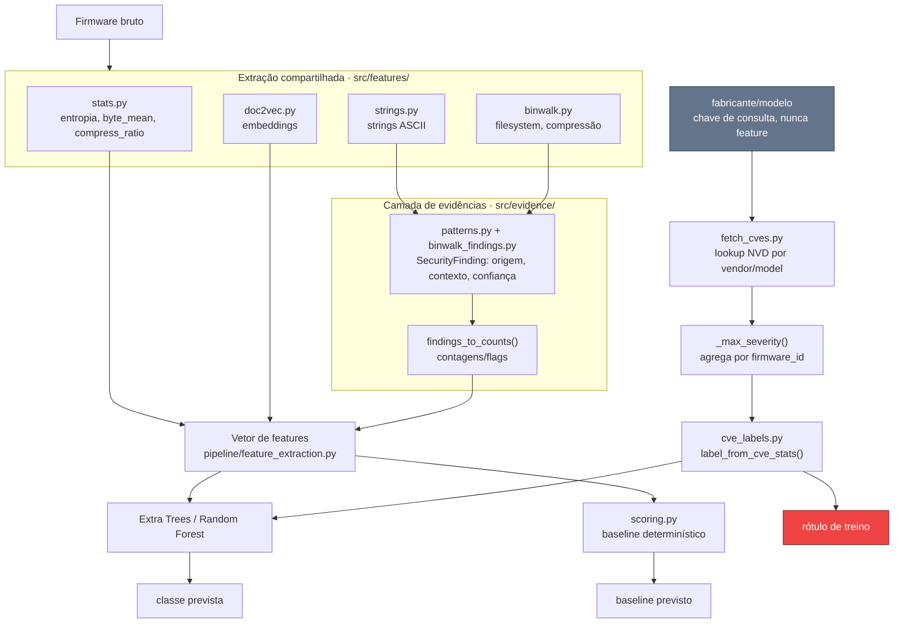

# Pipeline de classificação por CVE

Este documento consolida a arquitetura resultante do refactor em
`refactor/project-structure-review`: como o firmware é extraído,
interpretado como evidência, rotulado por CVE e classificado, mantendo
features e rótulo de treino em contratos independentes.

## Princípio central

> A extração identifica fatos observáveis; a camada de evidências
> interpreta esses fatos; a rotulagem usa uma fonte externa (CVE),
> independente das features; o classificador infere a classe; o
> baseline determinístico serve só de comparação, nunca de verdade.

```
firmware bruto -> extração -> evidência -> features + rótulo CVE -> classificador / baseline
```

## Visão geral



## Os quatro estágios

Cada estágio tem um contrato de entrada/saída próprio e pode ser testado
isoladamente.

### 1. Extração (núcleo compartilhado)

Lê o binário e produz fatos observáveis, sem julgamento de segurança nem
alvo de classificação embutido.

- `src/feature_extraction.py`
- `src/features/statistics.py` (entropia, byte_mean, compress_ratio)
- `src/features/strings.py`, `src/features/doc2vec.py`
- `src/features/binwalk.py` (sinais estruturais: filesystem, compressão)

### 2. Camada de evidências

Interpreta as strings e a saída do Binwalk já extraídas. Nunca lê o
firmware de novo.

- `src/evidence/findings.py` define `SecurityFinding` (type, source,
  context, confidence, detector, detector_version)
- `src/evidence/patterns.py`: 8 detectores (credenciais, IPs, serviços
  expostos, libs desatualizadas, URLs, tokens)
- `src/evidence/binwalk_findings.py`: assinaturas de cripto e seções
  criptografadas
- `scripts/extract_features.py --findings-output` grava os achados em
  JSONL, correlacionáveis ao `features.parquet` por `firmware_id`

### 3. Rotulagem por CVE

O rótulo de treino nunca depende de uma feature do firmware, só de CVE
por vendor/model.

- `scripts/fetch_cves.py`: lookup na NVD API v2.0
- `src/labeling/cve_labels.py`: `label_from_cve_stats()` mapeia
  `cve_total`/`cvss_max` direto para a classe
- `scripts/generate_labels.py`: monta `labels.csv`; um par vendor/model
  ausente no cache **falha com erro**, não vira `sem_cve_conhecida`
  silenciosamente
- `_max_severity()`: firmware byte a byte idêntico reaproveitado sob
  vários nomes de modelo ("rebadge") herda a severidade máxima entre os
  alias, nunca o rótulo de um alias isolado (ver seção seguinte)

### 4. Classificação e baseline

O classificador nunca vê CVE; o baseline nunca é tratado como verdade.

- Extra Trees (modelo principal), Random Forest (baseline de ML)
- `src/scoring.py`: baseline determinístico baseado em regras (stats +
  strings + binwalk, sem sinal CVE)
- Teste de guarda em `tests/test_pipeline_extraction.py` bloqueia
  `cvss_max`, `cve_count_*`, `cve_total`, `brand`, `model` do vetor de
  features

## Mecanismo: firmware reaproveitado sob vários modelos

Fabricantes reaproveitam o mesmo binário sob nomes comerciais diferentes
(hardware "rebadged"). A cobertura de pesquisa de CVE varia por nome de
modelo mesmo quando o código é idêntico.

Exemplo real do dataset: o `firmware_id` `037823e4...` (firmware ASUS
RT-AC68) aparece em 9 pastas de `dataset/raw/asus/`. Antes da agregação,
cada alias buscava sua própria entrada no cache CVE:

| Alias | CVEs encontradas |
|---|---|
| `rt-ac68u` | 19 (CVSS 9.8) |
| `rt-ac68p` | 7 (CVSS 9.8) |
| `rt-ac68r` | 4 (CVSS 9.8) |
| `rt-ac68w` | 3 (CVSS 9.8) |
| outros 5 alias | 0 |

O mesmo binário recebia `cve_critica` sob um nome e `sem_cve_conhecida`
sob outro. `_max_severity()` (`scripts/generate_labels.py`) agrega por
`firmware_id` antes de rotular: todos os 9 alias herdam a maior
severidade encontrada entre eles.

## Antes / depois do refactor

| | Antes | Depois |
|---|---|---|
| Alvo | fabricante/tipo de dispositivo | classe de vulnerabilidade conhecida |
| Rótulo | `score_firmware()` combinando stats + strings + binwalk + CVE | `label_from_cve_stats()`, só CVE agregado por firmware |
| Classes | `seguro` / `vulneravel` / `critico` | `sem_cve_conhecida` / `cve_conhecida` / `cve_critica` |
| Risco de vazamento | classificador podia reaprender a própria fórmula do scoring | teste de guarda impede CVE/brand/model no vetor de features |
| Par ausente no cache CVE | virava `seguro` silenciosamente | interrompe a execução com erro |

## Escala de severidade

Ordenada por `LEVEL_ORDER` em `src/labeling/cve_labels.py`. Hard rules
(`has_telnetd`, `has_debug_account`, senha hardcoded) só escalam para
cima, nunca rebaixam.

| Classe | Definição |
|---|---|
| `sem_cve_conhecida` | Nenhuma CVE encontrada para o par vendor/model consultado. Não prova ausência de vulnerabilidade, só ausência de evidência na NVD. |
| `cve_conhecida` | Ao menos uma CVE abaixo do limiar crítico (CVSS < 9.0 por padrão). |
| `cve_critica` | CVE com CVSS >= 9.0 (`CveLabelThresholds.critical_cvss`, ajustável via `--critical-cvss`). |

## Estado real do dataset (última rodada)

840 firmwares, `extract-features` + `generate-labels` contra
`dataset/raw/`:

| Classe | Contagem | % |
|---|---:|---:|
| `sem_cve_conhecida` | 378 | 45,0% |
| `cve_conhecida` | 38 | 4,5% |
| `cve_critica` | 424 | 50,5% |

3049 achados estruturados em `findings.jsonl`.

### Pendências conhecidas (ver `TODO.md`)

- `models/doc2vec.model` não existe ainda. As 100 colunas `doc2vec_*`
  estão zeradas até rodar `train-doc2vec`.
- 43 pares `tp_link/*` no cache foram buscados antes da correção do
  alias de vendor, precisam de `fetch_cves.py --force`.
- Detector `hardcoded_passwords`: 98,6% dos achados são token avulso
  (ex. `"System halted"` contado por conter `"system"`). Ajuste em
  outra branch.
- `dataset/raw/tplink/` (underscore) e `dataset/raw/tp_link/` (hífen)
  têm modelos equivalentes sob grafias diferentes, não consolidado.

## Ilustração visual

Uma versão navegável e ilustrada deste fluxo está publicada como
Artifact: https://claude.ai/artifact/Du4StfnEjSpDB2eyXN8LBn

## Referências

- `AGENTS.md`: escopo científico e regras de integridade
- `README.md`: comandos de CLI e API interna
- `docs/SCORING.md`: detalhe do baseline determinístico
